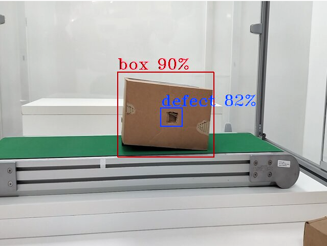

# Get Started Guide

-   **Time to Complete:** 5 - 15 minutes
-   **Programming Language:** Python 3

## Prerequisites

Ensure that the following installations are present.

* unzip. It can be installed using `sudo apt-get install unzip`
*
  | OS  |  Python           |
  |-----|-------------------|
  |Ubuntu 22.04|      3.10  |
  
## Quick try out
Follow the steps in this section to quickly pull the latest pre-built Edge Video Analytics Microservice docker image followed by running a sample usecase. 

### Pull the image and start container

- Pull the image with the latest tag from dockerhub registry

   ```sh
     docker pull intel/edge-video-analytics-microservice:2.3.0
   ```

- Create `docker-compose.yml` file with below contents inside the docker folder within your work directory (`[EVAM_WORKDIR]/docker/`). `EVAM_WORKDIR` is your host machine workspace:

   ```yaml
    #
    # Copyright (C) 2024 Intel Corporation
    # SPDX-License-Identifier: Apache-2.0
    #

    services:
      edge-video-analytics-microservice:
        image: intel/edge-video-analytics-microservice:2.3.0
        hostname: edge-video-analytics-microservice
        container_name: edge-video-analytics-microservice
        read_only: true
        security_opt:
        - no-new-privileges
        privileged: false
        tty: true
        entrypoint: ["./run.sh"]
        ports:
          - '8080:8080'
          - '8554:8554'
        networks:
          - app_network
        environment:
          - ENABLE_RTSP=true
          - RTSP_PORT=8554
          - no_proxy=$no_proxy,${RTSP_CAMERA_IP}
          - http_proxy=$http_proxy
          - https_proxy=$https_proxy
          - RUN_MODE=EVA
          - GENICAM=Balluff
          - GST_DEBUG=1,gencamsrc:2
          # Default Detection and Classification Device
          - DETECTION_DEVICE=CPU
          - CLASSIFICATION_DEVICE=CPU
          - ADD_UTCTIME_TO_METADATA=true
          - LSFEATURE_NAME="EVAM"
          - HTTPS=false # Make it "true" to enable SSL/TLS secure mode, mount the generated certificates
          - MTLS_VERIFICATION=false # if HTTPS=true, enable/disable client certificate verification for mTLS
          # Model Registry Microservice
          - MR_VERIFY_CERT=/run/secrets/ModelRegistry_Server/ca-bundle.crt
          # Append pipeline name to a publisher topic
          - APPEND_PIPELINE_NAME_TO_PUBLISHER_TOPIC=false
          - REST_SERVER_PORT=8080
        volumes:
          # - "../configs/default/config.json:/home/pipeline-server/config.json"
          - vol_evam_pipeline_root:/var/cache/pipeline_root:uid=1999,gid=1999
          - "../certificates:/MqttCerts:ro"
          - "../Certificates/ssl_server/:/run/secrets/EdgeVideoAnalyticsMicroservice_Server:ro"
          - "../Certificates/model_registry/:/run/secrets/ModelRegistry_Server:ro"
          - "/run/udev:/run/udev:ro"
          - "/dev:/dev"
          - "/tmp:/tmp"
          - "./mr_models:/home/pipeline-server/mr_models:rw"
        group_add:
          - "109"
          - "110"
        device_cgroup_rules:
        - 'c 189:* rmw'
        - 'c 209:* rmw'
        - 'a 189:* rwm'
        devices:
        - "/dev:/dev"

    networks:
      app_network:
        driver: "bridge"

    volumes:
      vol_evam_pipeline_root:
        driver: local
        driver_opts:
          type: tmpfs
          device: tmpfs
   ```

- Bring up the container
   ```sh
     docker compose up
   ```
### Run default sample

Once the container is up, we will send a pipeline request to EVAM to run a detection model on a warehouse video. Both the model and video are provided as default sample in the docker image.

We will send the below curl request to run the inference.
It comprises of a source file path which is `warehouse.avi`, a destination, with metadata directed to a json fine in `/tmp/resuts.jsonl` and frames streamed over RTSP with id `pallet-defect-detection`. Additionally, we will also provide the GETi model path that would be used for detecting defective boxes on the video file.

Open another terminal and send the following curl request
``` sh
    curl http://localhost:8080/pipelines/user_defined_pipelines/pallet_defect_detection -X POST -H 'Content-Type: application/json' -d '{
    "source": {
        "uri": "file:///home/pipeline-server/resources/videos/warehouse.avi",
        "type": "uri"
    },
    "destination": {
        "metadata": {
            "type": "file",
            "path": "/tmp/results.jsonl",
            "format": "json-lines"
        },
        "frame": {
            "type": "rtsp",
            "path": "pallet-defect-detection"
        }
    },
    "parameters": {
        "detection-properties": {
            "model": "/home/pipeline-server/resources/models/geti/pallet_defect_detection/deployment/Detection/model/model.xml",
            "device": "CPU"
        }
    }
}'
```

The REST request will return a pipeline instance ID, which can be used as an identifier to query later the pipeline status or stop the pipeline instance. For example, a6d67224eacc11ec9f360242c0a86003.

- To view the metadata, open another terminal and run the following command,
  ```sh
    tail -f /tmp/results.jsonl
  ```

- RTSP Stream will be accessible at `rtsp://<SYSTEM_IP_ADDRESS>:8554/pallet-defect-detection`.  Users can view this on any media player e.g. vlc (as a network stream), ffplay etc 

  

To check the pipeline status and stop the pipeline send the following requests,

 - view the pipeline status that you triggered in the above step.
   ```sh
    curl --location -X GET http://localhost:8080/pipelines/status
   ```

 - stop a running pipeline instance, 
   ```sh
    curl --location -X DELETE http://localhost:8080/pipelines/{instance_id}
   ```

Now you have successfully run the Edge Video Analytics Microservice container, sent a curl request to start a pipeline within the microservice which runs the Geti based pallet defect detection model on a sample warehouse video. Then, you have also looked into the status of the pipeline to see if everything worked as expected and eventually stopped the pipeline as well.


## Summary

In this get started guide, you learned how to start the EVAM service and start default pipeline.

## Learn More

-   For getting started with the deployment on k8s with helm chart, please go [here](./Get-Started-Guide-Helm.md)
-   Understand the components, services, architecture, and data flow, in
    the [Overview](Overview.md).
-   For more details on advanced configuration, usage of features refer to [Detailed Usage](./detailed_usage/Detailed-Usage.md)
-   For more tutorials, refer to [Tutorials How-to guide](./Tutorials-How-To.md).
-   For more details on Intel Deep Learning Streamer visit [this](https://dlstreamer.github.io/) page.

## Legal Information
Intel, the Intel logo, and Xeon are trademarks of Intel Corporation in the U.S. and/or other countries.

GStreamer is an open source framework licensed under LGPL. See [GStreamer licensing](https://gstreamer.freedesktop.org/documentation/frequently-asked-questions/licensing.html)⁠. You are solely responsible for determining if your use of GStreamer requires any additional licenses. Intel is not responsible for obtaining any such licenses, nor liable for any licensing fees due, in connection with your use of GStreamer.

*Other names and brands may be claimed as the property of others.
