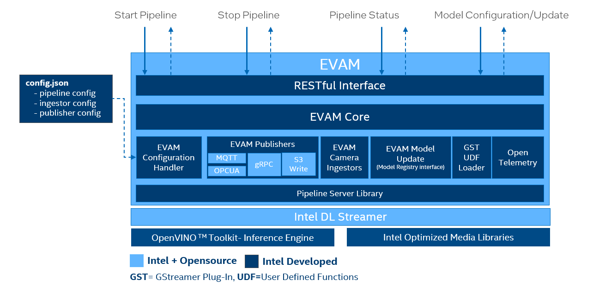

# Edge Video Analytics Microservice
Edge Video Analytics Microservice is a Python-based, interoperable containerized microservice for easy development and deployment of video analytics pipelines.

## Overview

Edge Video Analytics Microservice is a Python-based, interoperable containerized microservice for easy development and deployment of video analytics pipelines. It is built on top of [GStreamer](https://gstreamer.freedesktop.org/documentation/) and [Intel® Deep Learning Streamer (DL Streamer)](https://dlstreamer.github.io/) , providing video ingestion and deep learning inferencing functionalities.

Video analytics involves the conversion of video streams into valuable insights through the application of video processing, inference, and analytics operations. It finds applications in various business sectors including healthcare, retail, entertainment, and industrial domains. The algorithms utilized in video analytics are responsible for performing tasks such as object detection, classification, identification, counting, and tracking on the input video stream.

## How it Works

Here is the high level description of functionality of EVAM module:

   - **RESTful Interface** 
      Exposes RESTful endpoints to discover, start, stop and customize pipelines in JSON format. 
   
   - **EVAM Core** 
      Manages and processes the REST requests interfacing with the core EVAM components and Pipeline Server Library.
   
   - **EVAM Configuration handler** 
      Reads the contents of config file and accordingly constructs/starts pipelines. Dynamic configuration change is supported via REST API.
   
   - **GST UDF Loader** 
      EVAM provides a [GStreamer plugin](https://gstreamer.freedesktop.org/documentation/plugins_doc.html?gi-language=c) - `udfloader` using which users can configure and load arbitrary UDFs. With `udfloader`, EVAM provides an easy way to bring user developed programs and run them as a part of GStreamer pipelines. A User Defined Function (UDF) is a chunk of user code that can transform video frames and/or manipulate metadata. For example, a UDF can act as filter, preprocessor, classifier or a detector. These User Defined Functions can be developed in Python.
   
   - **EVAM Camera Ingestion** 
      EVAM supports ingesting frames from external camera sources into the GStreamer pipeline, for example see [here](https://gstreamer.freedesktop.org/documentation/rtsp/rtspsrc.html?gi-language=c)

   - **EVAM Publisher** 
      Supports publishing metadata to file, MQTT/Kafka message brokers and frame along with metadata to MQTT message broker. We also support publishing metadata and frame over gRPC and OPCUA. The frames can also be saved on S3 compliant storage.
   
   - **EVAM Model Update** 
      Supports integration with Model Registry service [MRaaS](https://docs.edgeplatform.intel.com/model-registry-as-a-service/1.0.1/user-guide/Overview.html) for model download, deployment and management.

   - **Open Telemetry** 
      Supports gathering metrics over Open Telemetry for seamless visualization and analysis. 

