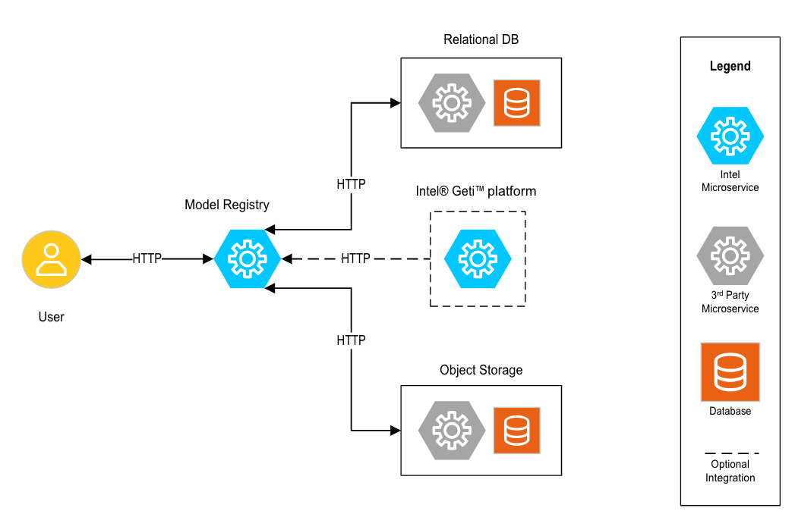

# Overview and Architecture

The Model Registry microservice provides a centralized repository that facilitates the management of AI models.

Its primary purpose is to streamline the processes of versioning, storing, and accessing models, ensuring consistency and traceability across environments.

The model registry addresses several key problems:

* **Version Control**: It resolves issues related to tracking and managing different versions of models.

* **Reproducibility and Traceability**: By maintaining detailed records of model metadata, it ensures that models can be reproduced and audited, which is essential for compliance and governance.

* **Deployment Efficiency**: It simplifies the deployment process by providing interfaces to reduce the risk of errors and inconsistencies in model deployments.

## Key Features
* **Feature 1**: Provides a comprehensive set of REST API endpoints for operations such as registering, updating, retrieving, and deleting models.
* **Feature 2**: Utilizes a relational database to store structured data related to models, ensuring data integrity.
* **Feature 3**: Leverages an object storage solution for scalable storage and retrieval of unstructured data, including model binaries and artifacts.
* **Feature 4**: Offers optional configurations to integrate with the Intel® Geti™ platform, enabling access to projects and models hosted on a remote Geti platform.

## Architecture Overview

### High-Level Architecture Diagram
  
*Figure 1: High-level system view demonstrating the microservice.*

### Inputs
* **Model Artifacts**: Includes model binaries, and any associated metadata.
* **API Requests**: REST API calls for operations such as model registration, updates, retrievals, and deletions.
* **Metadata**: Information about the model, such as version, score, and other metrics.
* **External Integrations**: Configuration data for connecting to external platforms like Intel® Geti™.

### Processing Pipeline
* **Validation**: Ensures that incoming data and model artifacts meet predefined standards and formats.
* **Storage Management**: Stores structured data in a relational database and unstructured data in object storage.
* **Integration Handling**: Manages connections and data exchange with external platforms and services.

### Outputs
* **API Responses**: Provides feedback on operations, including success or error messages, and returns requested model data.
* **Model Metadata**: Outputs detailed information about models, including version and performance metrics.
* **Deployment Artifacts**: Prepares and delivers model binaries and configurations for deployment.
* **Audit Logs**: Generates logs for all operations, supporting traceability and compliance requirements.

## Supporting Resources
* [Get Started Guide](get-started.md)
* [API Reference](api-reference.md)
* [System Requirements](system-requirements.md)
