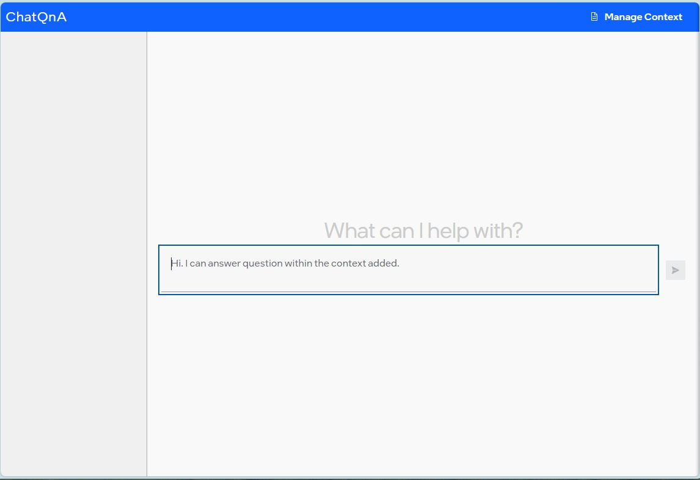

# Chat Question-and-Answer Core Sample Application

ChatQ&A sample application is a foundational Retrieval Augmented Generation (RAG) pipeline, enabling users to ask questions and receive answers including on their own private data corpus. The sample application demonstrates how to build RAG pipelines. Compared to the [Chat Question-and-Answer](https://github.com/open-edge-platform/edge-ai-libraries/tree/main/sample-applications/chat-question-and-answer) implementation, this implementation of Chat Question-and-Answer Core is optimized for memory footprint as it is built as a single monolithic application with the entire RAG pipeline bundled in a single microservice. The microservice supports a bare metal deployment through docker compose installation to emphasize on the monolithic objective.

## Table of Contents

1. [Overview and Architecture](#overview-and-architecture)
2. [How to Use the Application](#how-to-use-the-application)

## Overview and Architecture

### Key Features

Key features include:

- **Optimized RAG pipeline on Intel Tiber AI Systems hardware**: The application is [optimized](https://github.com/open-edge-platform/edge-ai-libraries/blob/main/sample-applications/chat-question-and-answer-core/docs/user-guide/benchmarks.md) to run efficiently on Intel® hardware, ensuring high performance and reliability. Given the memory optimization, this version is also able to address the Core portfolio.
- **Supports a wide range of open-source models**: Intel's suite of inference microservices provides flexibility to use the right GenAI models (LLM, for example) as required for target usage. The application supports various [open-source models](https://huggingface.co/OpenVINO), allowing developers to select the best models for their use cases.
- **Self-hosting inference**: Perform inference locally or on-premises, ensuring data privacy and reducing latency.
- **Observability and monitoring**: The application provides observability and monitoring capabilities using [OpenTelemetry](https://opentelemetry.io/) & [OpenLIT](https://github.com/openlit/openlit), enabling developers to monitor the application's performance and health in real-time.

### Technical Architecture
The Chat Question-and-Answer Core sample application is implemented as a LangChain based RAG pipeline with all the inference models (i.e. LLM, Embedding, and reranker) executed in the context of a single OpenVINO® runtime. The approach is documented in the OpenVINO [documentation](https://blog.openvino.ai/blog-posts/accelerate-inference-of-hugging-face-transformer-models-with-optimum-intel-and-openvino). Readers are requested to refer to this documentation for the technical details.

## How to Use the Application

The Chat Question-and-Answer Core sample application consists of two main parts:

1. **Data Ingestion [Knowledge Building]**: This part is responsible for adding documents to the ChatQ&A instance. The data ingestion step allows ingestion of common document formats like pdf and doc. The ingestion process cleans and formats the input document, creates embeddings of the documents using embedding microservice, and stores them in the preferred vector database. CPU version of [FAISS](https://faiss.ai/index.html) is used as VectorDB.

2. **Generation [Q&A]**: This part allows the user to query the document database and generate responses. The LLM model, embedding model, and reranking model work together to provide accurate and efficient answers to user queries. When a user submits a question, the query is converted to an embedding enabling semantic comparison with stored document embeddings. The vector database searches for relevant embeddings, returning a ranked list of documents based on semantic similarity. The LLM generates a context-aware response from the final set of documents.

Detailed Hardware and Software requirements are available [here](https://github.com/open-edge-platform/edge-ai-libraries/blob/main/sample-applications/chat-question-and-answer-core/docs/user-guide/system-requirements.md).

## Benchmark Results

Detailed metrics and  analysis can be found in the benchmark report [here](https://github.com/open-edge-platform/edge-ai-libraries/blob/main/sample-applications/chat-question-and-answer-core/docs/user-guide/benchmarks.md).

<!--
## Support and Community

This section provides information on how to get support and engage with the community.
 -->
