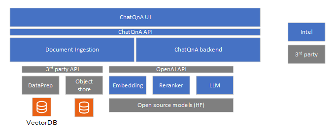

# ChatQ&A Sample Application

ChatQ&A sample application is a foundational Retrieval-Augmented Generation (RAG) pipeline that allows users to ask questions and receive answers, including those based on their own private data corpus. The sample application demonstrates how to build a RAG pipeline using Intel's Edge AI microservices catalog and deploy it optimally on Intel's Edge AI systems. This sample application simplifies the development, customization, and deployment of chat applications in diverse deployment scenarios with out-of-the-box support for on-prem and edge environments.

## Table of Contents

1. [Overview and Architecture](#overview-and-architecture)
2. [How to Use the Application](#how-to-use-the-application)
3. [Benchmarks](#benchmark-results)
4. [Release Notes](#release-notes)
5. [Support and Community](#support-and-community)

## Overview and Architecture

### Key Features

Key features include:

- **Optimized RAG pipeline on Intel Edge AI Systems hardware**: The application is [optimized](./benchmarks.md) to run efficiently on Intel® Edge AI systems hardware, ensuring high performance and reliability.
- **Customizable RAG pipeline with optimized microservices**: Intel's Edge AI [inference microservices](../../../../microservices/) allow developers to customize and adapt specific parts of the application to suit their deployment and usage needs. For example, developers can customize the data ingestion process for specific document types without altering the rest of the RAG pipeline. Intel's inference microservices provide the flexibility to tailor the application for specific deployment scenarios and usage requirements without compromising performance on the given deployment hardware.
- **Flexible deployment options**: The application provides options for deployment using Docker Compose and Helm charts, enabling developers to choose the best deployment environment for their needs.
- **Support for a wide range of open-source models**: Intel's inference microservices provide flexibility to use the right GenAI models (LLM, for example) as required for target usage. The application supports various [open-source models](https://huggingface.co/OpenVINO), allowing developers to select the best models for their use cases.
- **Self-hosting inference**: Perform inference locally or on-premises, ensuring data privacy and reducing latency.
- **Observability and monitoring**: The application provides observability and monitoring capabilities using [OpenTelemetry](https://opentelemetry.io/) & [OpenLIT](https://github.com/openlit/openlit), enabling developers to monitor the application's performance and health in real-time.

### Technical Architecture

The ChatQ&A sample application includes the following components:

- **LLM inference microservice**: Intel's optimized [OpenVINO Model Server (OVMS)](https://github.com/openvinotoolkit/model_server) is used to efficiently run large language models on Intel hardware. Developers also have other model serving options if required.
- **Embedding inference microservice**: Huggingface [Text Embeddings Inference](https://github.com/huggingface/text-embeddings-inference) microservice is used to run embedding models efficiently on target Intel hardware.
- **Reranking inference microservice**: Intel’s optimized [OVMS](https://github.com/openvinotoolkit/model_server) model serving is used to run reranking models optimally on target Intel hardware. Text Embeddings Inference (TEI) is an alternative model serving choice available.
- **Data ingestion microservice**: The sample data ingestion microservice allows ingestion of common document formats like PDF and DOC. The ingestion process creates embeddings of the documents and stores them in the preferred vector database. The modular architecture allows users to customize the vector database. The sample application uses [PGvector](https://github.com/pgvector/pgvector) database. The raw documents are stored in the MinIO datastore, which is also customizable.

Further details on the system architecture and customizable options are available [here](./overview-architecture.md).

## How to Use the Application

The ChatQ&A sample application consists of two main parts:

1. **Data Ingestion [Knowledge Building]**: This part is responsible for adding documents to the ChatQ&A instance. The data ingestion microservice allows ingestion of common document formats like PDF and DOC. The ingestion process cleans and formats the input document, creates embeddings of the documents using the embedding microservice, and stores them in the preferred vector database. The modular architecture allows users to customize the vector database. The sample application uses [PGvector](https://github.com/pgvector/pgvector) database. The raw documents are stored in the MinIO datastore, which is also customizable.

2. **Generation [Q&A]**: This part allows the user to query the document database and generate responses. The LLM inference microservice, embedding inference microservice, and reranking microservice work together to provide accurate and efficient answers to user queries. When a user submits a question, the embedding model hosted by the TEI Inference Microservice transforms it into an embedding, enabling semantic comparison with stored document embeddings. The vector database searches for relevant embeddings, returning a ranked list of documents based on semantic similarity. The LLM Inference Microservice generates a context-aware response from the final set of documents.

Further details on the system architecture and customizable options are available [here](./overview-architecture.md).

Detailed hardware and software requirements are available [here](./system-requirements.md).

To get started with the application, please refer to the [Get Started](./get-started.md) page.

[This sample application is ready for deployment with Edge Orchestrator. Download the deployment package and follow the instructions](deploy-with-edge-orchestrator.md)

## Benchmark Results

Detailed metrics and analysis can be found in the benchmark report [here](./benchmarks.md).

<!--
## Support and Community

This section provides information on how to get support and engage with the community.
-->
